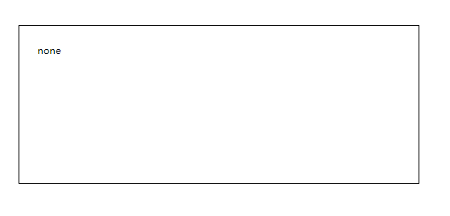
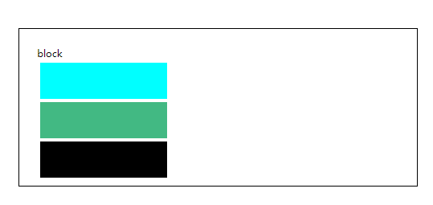

# display属性简介
> Author: 黄自鑫  
> Description: display属性简介   
> Last Modified: 2019.09.29

## display属性
### 了解什么是块级元素与行级元素
#### 块级元素
>会占领页面的一行，其后多个block元素自动换行、 可以设置width，height，设置了width后同样也占领一行、同样也可以设置margin与padding属性。常见的块级元素:div,img,ul,form,p等

#### 行级元素
>与其他元素在同一行上，高度，行高以及底边距不可改变，高度就是内容文字或者图片的宽度，不可以改变。em，strong，br,input等

### display属性的用途
> display属性规定元素应该生成的框的类型，默认值为inline

> js语法`element.style.display="block"`

> css语法`display: inline`

>

### display属性的可以应用的值

#### none
> 此元素不会被显示
>
> display:none可以隐藏某个元素，且隐藏的元素不会占用任何空间。也就是说，该元素不但被隐藏了，而且该元素原本占用的空间也会从页面布局中消失。
visibility:hidden可以隐藏某个元素，但隐藏的元素仍需占用与未隐藏之前一样的空间。也就是说，该元素虽然被隐藏了，但仍然会影响布局。

#### inline
>此元素会被显示为内联元素，元素前后没有换行符。高度，行高以及底边距不可改变，高度就是内容文字或者图片的宽度，不可以改变。多个相邻的行内元素排在同一行里，直到页面一行排列不下，才会换新的一行。

>

>可以通过padding和margin来控制元素大小

>
#### block
>此元素将显示为块级元素，此元素前后会带有换行符。
>总是以一个块的形式表现出来，占领一整行。若干同级块元素会从上之下依次排列（使用float属性除外）。
>常见的块元素由<p\><div\><h1\><li\>等等。

>

#### inline-block
>inline-block看上去值名inline-block是一个混合产物，实际上确是如此，将元素显示为行内块状元素，设置该属性后，其他的行内块级元素会排列在同一行。比如我们li元素一个inline-block，使其既有block的宽度高度特性，又有inline的同行特性，在同一行内有不同高度内容的元素时，通常要设置对齐方式如vertical-align: top;来使元素顶部对齐。

>

>inline-block和float属性有相似的地方，也有它的优点，网上的一张图

>

>

>

>
#### inherit
>规定此元素应该从父元素继承 display 属性的值。
素自动成为容器成员，称为Flex项目（flex item），简称”项目”。

#### table
>此元素会作为块级表格来显示(类似 <table\>),表格前后带有换行符。
父元素宽度固定，想让若干个子元素平分宽度。

#### list-item
>此元素会作为列表显示。html标签中：<li\> display属性默认为list-item其它标签设置了这个属性后，就可以将其当做<ul\>标签来使用了，可以设置其list-style。

#### flex
<https://www.cnblogs.com/qingchunshiguang/p/8011103.html>
>Flex是Flexible Box的缩写，意为”弹性布局”，用来为盒状模型提供最大的灵活性。

>采用Flex布局的元素，称为Flex容器（flex container），简称”容器”。它的所有子元素自动成为容器成员，成为Flex项目(Flex item)

>##### 主轴
>容器默认存在两根主轴：水平方向主轴(main axis)和垂直方向交叉轴(cross axis)，默认项目按主轴排列。

>##### 容器属性
>flex-direction 决定主轴的方向（即项目的排列方向）

>flex-wrap 定义换行情况

>flex-flow flex-direction和flex-wrap的简写，默认row nowrap

>justify-content 定义项目在主轴上的对齐方式。

>align-item 定义在交叉轴上的对齐方式

>align-content 定义多根轴线的对齐方式

>

>##### item属性
>order

>flex-grow

>flex-shrink

>flex-basis

>flex

>align-self

>>
