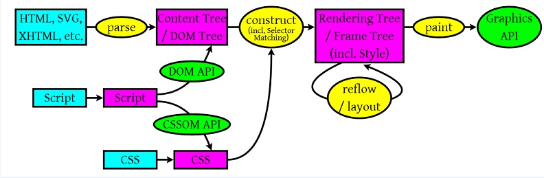

# 网页渲染步骤
> Author: TanYJie  
> Description: 介绍浏览器从拿到文件，到渲染出界面的过程   
> Last Modified: 2019.09.26

  

1. 浏览器拿到服务器给的 HTML 文档
2. 解析 HTML 生成 DOM 树。
3. 解析 CSS 生成 CSSOM 规则树。
4. 将 DOM 树与 CSSOM 规则树合并在一起生成 渲染树（render tree）。
5. 遍历渲染树开始布局，计算每个节点的位置大小信息。
6. 将渲染树每个节点绘制到屏幕。

 

## 回流与重绘（reflow 和 repaint）
* 回流（reflow）：指的是浏览器为了重新渲染部分或全部的文档而重新计算文档中元素的位置和几何结构的过程。
* 重绘（repaint）：是一个元素外观的改变所触发的浏览器行为，例如改变 vidibility、outline、背景色等属性。浏览器会根据元素的新属性重新绘制，使元素呈现新的外观。
