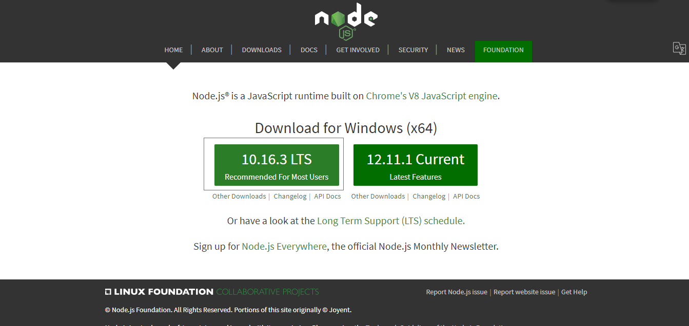
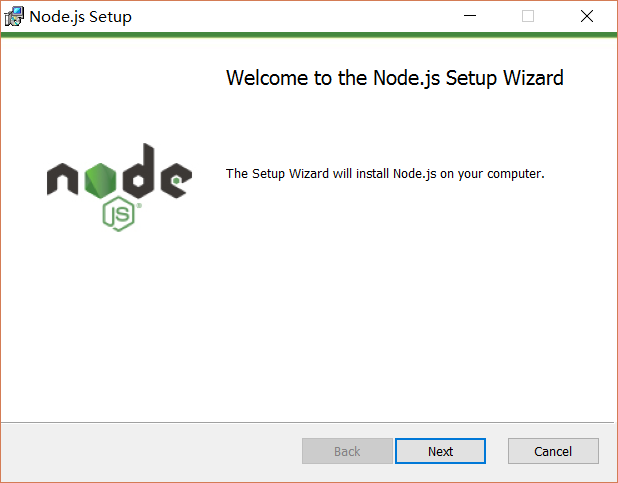
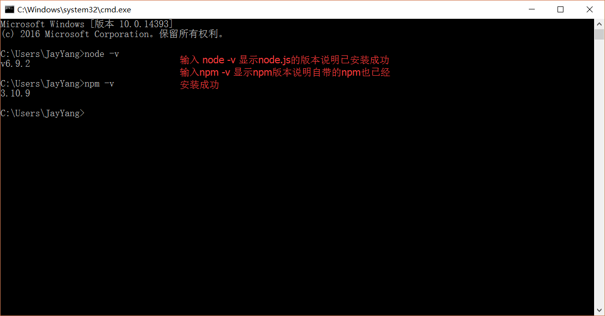
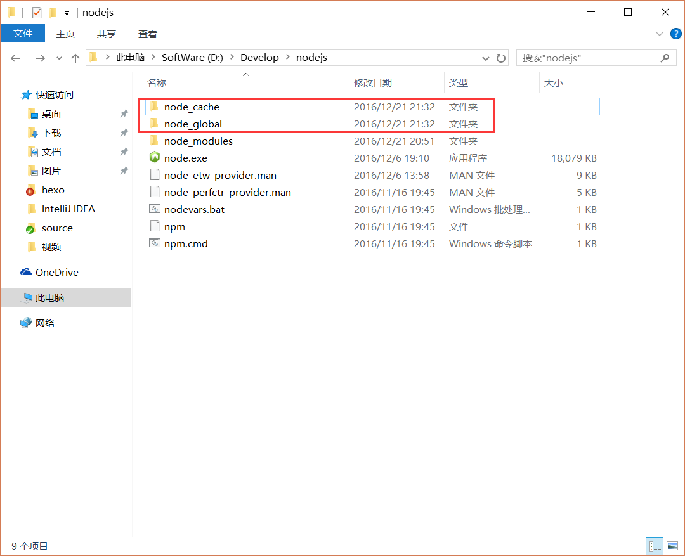
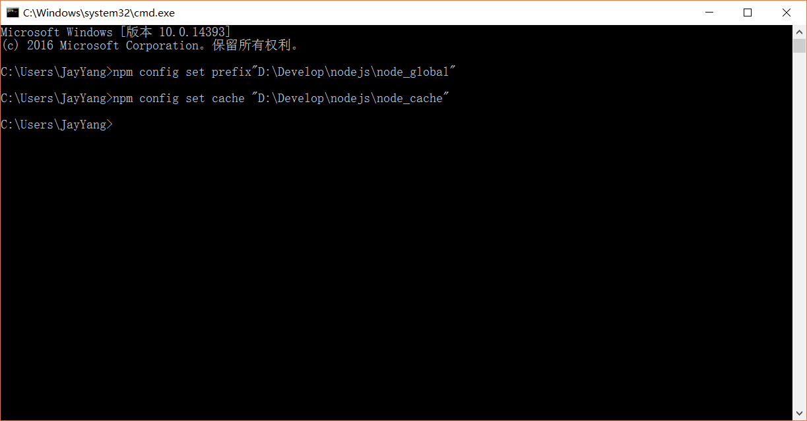
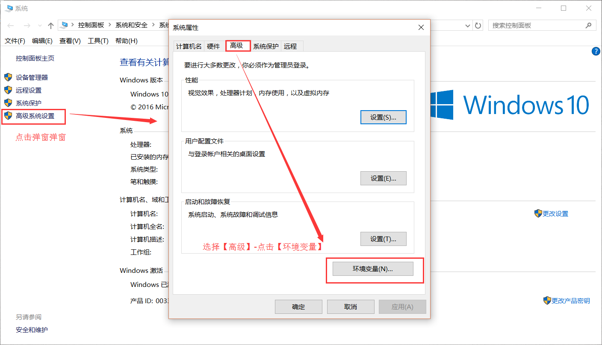

# 1. 安装 Node.js 环境
官网下载 Node.js 稳定版安装包（https://nodejs.org/en/）



下载完成后，双击打开，开始安装 Node.js




一路默认，可以根据需要换一下安装目录。

至此 Node.js 已经安装完成，可以先进行下简单的测试安装是否成功了，在键盘按下【win+R】键，输入 cmd，然后回车，打开控制台窗口，执行以下语句，如果正确出现版本号信息，则安装成功。
```
node -v
npm -v
```



现在开始环境变量配置

说明：这里的环境配置主要配置的是 npm 安装的全局模块所在的路径，以及缓存 cache 的路径，之所以要配置，是因为以后在执行类似：npm install express [-g] （后面的可选参数-g，g 代表 global 全局安装的意思）的安装语句时，会将安装的模块安装到【C:\Users\用户名\AppData\Roaming\npm】路径中，占C盘空间。
例如：我希望将全模块所在路径和缓存路径放在我node.js安装的文件夹中，则在我安装的文件夹【D:\Develop\nodejs】下创建两个文件夹【node_global】及【node_cache】如下图：



创建完文件夹后，打开控制台，输入
```
npm config set prefix "D:\Develop\nodejs\node_global"
npm config set cache "D:\Develop\nodejs\node_cache"
```



完成后，关闭 cmd 窗口，打开 “我的电脑”-右键-“属性”-“高级系统设置”-“高级”-“环境变量”



1. 在【系统变量】下新建【NODE_PATH】，输入【D:\Develop\nodejs\node_global\node_modules】
2. 将【用户变量】下的【Path】中的【C:\Users\admin\AppData\Roaming\npm】修改为【D:\Develop\nodejs\node_global】

至此环境配置完成，让我们测试一下，打开控制台，执行
```
npm install bk-create-react -g
beike -a
```
